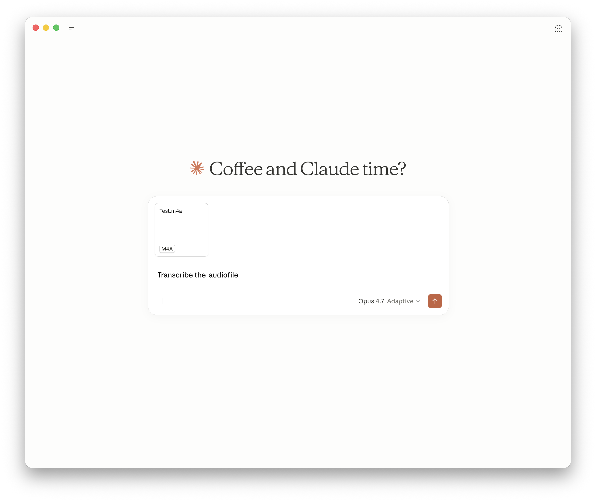

<div align="right">

<a href="https://railway.com?referralCode=QhjuBc">

  

</a>

</div>

# macwhisper-mcp-server
<!-- mcp-name: io.github.docdyhr/macwhisper-mcp-server -->

Local MCP server that connects [MacWhisper](https://goodsnooze.gumroad.com/l/macwhisper) to [Claude Desktop](https://claude.ai/download).

**What it does:** Drop an audio file on your Desktop, then ask Claude to transcribe it, summarise it, or pull out action items — in one step. MacWhisper does the transcription on your Mac; Claude does the thinking. Nothing leaves your machine. No cloud APIs. No data ever leaves your Mac.

```
Audio file  →  MacWhisper CLI  →  MCP server  →  Claude Desktop
```

[](https://github.com/docdyhr/macwhisper-mcp-server/actions/workflows/ci.yml)
[](https://github.com/docdyhr/macwhisper-mcp-server/actions/workflows/codeql.yml)
[](https://pypi.org/project/macwhisper-mcp-server/)
[](./LICENSE)

---



---

## Requirements

- macOS (MacWhisper is macOS-only)
- [MacWhisper](https://goodsnooze.gumroad.com/l/macwhisper) — installed and licensed
- MacWhisper CLI enabled: open MacWhisper → Settings → Advanced → Command-Line Tool → Install. This places `mw` at `/usr/local/bin/mw`.
- Python 3.13.x via [pyenv](https://github.com/pyenv/pyenv)
- [Claude Desktop](https://claude.ai/download)

**Installing MacWhisper via Homebrew:**
```bash
brew install --cask macwhisper
```
After installation, enable the CLI in MacWhisper Settings as above. When you later run `brew upgrade --cask macwhisper`, the CLI symlink updates automatically — no re-install needed.

---

## Install

### Option A — Homebrew (recommended)

```bash
brew tap docdyhr/tap
brew install docdyhr/tap/macwhisper-mcp-server
```

This installs the `macwhisper-mcp` binary into your Homebrew prefix. Upgrade later with `brew upgrade docdyhr/tap/macwhisper-mcp-server`.

### Option B — pip / source

```bash
pip install macwhisper-mcp-server
```

Or from source:

```bash
git clone https://github.com/docdyhr/macwhisper-mcp-server.git
cd macwhisper-mcp-server

pyenv install 3.13.13   # skip if already installed
pyenv local 3.13.13
python -m venv .venv
source .venv/bin/activate
pip install -e .
```

Verify the MacWhisper CLI is reachable:

```bash
mw version
```

---

## Configure Claude Desktop

Edit `~/Library/Application Support/Claude/claude_desktop_config.json` and add:

```json
{
  "mcpServers": {
    "macwhisper": {
      "command": "macwhisper-mcp",
      "args": [],
      "env": {
        "MACWHISPER_ALLOWED_PATHS": "~/Desktop:~/Downloads",
        "FASTMCP_CHECK_FOR_UPDATES": "off"
      }
    }
  }
}
```

Restart Claude Desktop.

> **Note:** Audio files must be saved to your Mac's filesystem (Desktop, Downloads, or another allow-listed folder) before asking Claude to transcribe them. Files uploaded directly to the Claude chat window live in Claude's container and are not accessible to the local MacWhisper CLI.

### Verify it works

In Claude Desktop, ask:

> Transcribe ~/Desktop/memo.m4a

You should see a `transcribe_audio` tool call appear, followed by the transcript.

---

## Available tools

| Tool | Description |
|------|-------------|
| `transcribe_audio(path, model?, persist?)` | Transcribe an audio file and return the transcript as plain text. Pass `persist=true` to save to MacWhisper history. |
| `list_models()` | List transcription models installed in MacWhisper; active model is marked |
| `cancel_transcription()` | Cancel the currently running transcription |
| `list_allowed_paths()` | Return the directories the server is allowed to read from |
| `start_watch(folder)` | Watch a folder and auto-transcribe new audio files into `../done/` |
| `stop_watch()` | Stop the active folder watcher |
| `get_watch_results()` | Return completed watch-folder transcriptions and clear the queue |

Supported audio formats: `.m4a` `.mp3` `.mp4` `.mov` `.wav` `.aiff` `.flac`

---

## Configuration

All configuration is via environment variables. Pass them through the `env` dict in `claude_desktop_config.json` (for Claude Desktop) or set them in `.env` for local development.

| Env var | Default | Description |
|---------|---------|-------------|
| `MACWHISPER_ALLOWED_PATHS` | `~/Desktop` | Colon-separated list of directories the server may read from |
| `MACWHISPER_CLI` | auto-detected | Path to the `mw` binary. Defaults to `/Applications/MacWhisper.app/Contents/MacOS/mw` if that file exists, otherwise `mw` on `PATH` |
| `MACWHISPER_LOG_PATH` | `~/Library/Logs/macwhisper-mcp.log` | Log file path (never stdout — that's reserved for MCP) |

**Local development:** copy `.env.example` to `.env` and adjust. With [direnv](https://direnv.net/), `.envrc` exports `.env` automatically. Without direnv: `source .env`.

---

## Development

```bash
source .venv/bin/activate
pip install -e ".[dev]"

# Tests
pytest -q

# Lint + format
ruff check .
ruff format .

# Pre-commit hooks (one-time setup)
pip install pre-commit
pre-commit install

# Smoke-test against a real audio file (server must not be running in Claude Desktop)
python scripts/smoke_test.py ~/Downloads/Test.m4a
```

### Logs

```bash
tail -f ~/Library/Logs/macwhisper-mcp.log
```

---

## Security

- All file paths are resolved (symlinks followed) and checked against the `MACWHISPER_ALLOWED_PATHS` allow-list before anything reaches the CLI.
- `subprocess.run` is always called with an argv list — never `shell=True`.
- No network calls. Ever.

See [PRD §7](./PRD.md) for the full threat model.

---

## Known limitations

- **Uploaded files:** Files dragged into the Claude chat window live in Claude's container and are not accessible to the local MacWhisper CLI. Save the file to your Desktop or Downloads folder (or another allow-listed directory), then ask Claude to transcribe it from there.
- **Danish letter names:** Whisper may phonetically approximate letter names (e.g. "Æ, Ø, Å" → "E, Y, U") when they are spoken in isolation. Letters *inside words* transcribe correctly. This is a Whisper engine limitation, not a bug in this wrapper. See [PRD §12](./PRD.md).
- **Cold-start latency:** First transcription after MacWhisper launches takes ~13s (model load). Subsequent calls are ~2s.

---

## License

MIT — see [LICENSE](./LICENSE).
